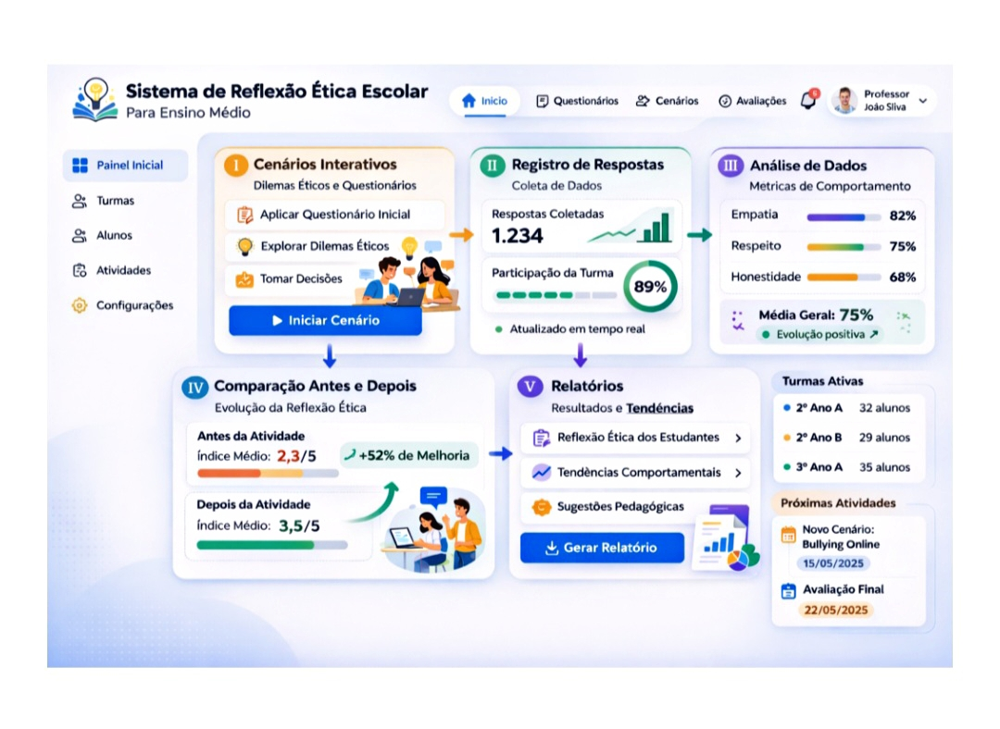

# Sistema de Reflexão Ética Escolar

  

---

### Sobre o Projeto
Desenvolvi este projeto para abordar temas como xenofobia e misoginia no ambiente digital. Sei que um sistema não resolve o problema sozinho, mas ele atua como uma influência na formação do caráter do aluno, provocando uma reflexão que nem sempre acontece de forma espontânea.

---

### 📄 Documentação Completa
Clique no link abaixo para visualizar o PDF:

* [Acesse o PDF aqui](sistema_reflexao_etica_corrigido_2pagin_out.PDF)
